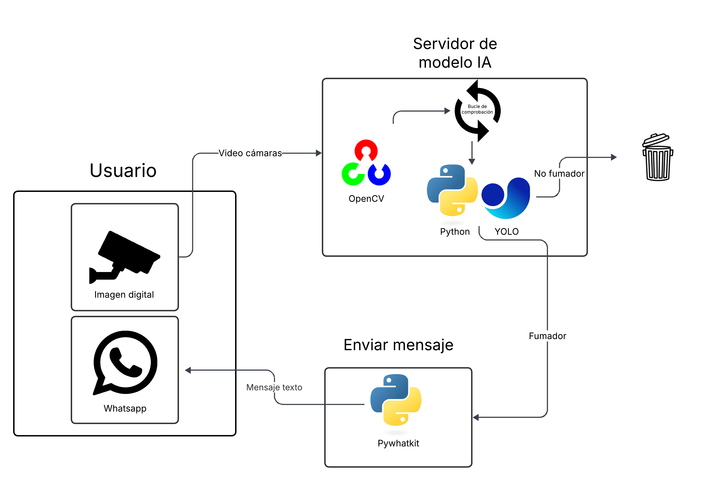

# SIC25es-Remember-Us-Recuerdanos-
---
Este proyecto trata de un sistema de detección en vivo de personas fumando, para eso, entrenamos distintos modelos de vision computarizada y los unimos con un sistema de visión en vivo.
 El proyecto tiene el fin detectar en tiempo real si una persona está fumando en áreas donde está prohibido, como gasolineras, fábricas con materiales inflamables o espacios públicos sensibles.

## Tabla de contenidos

1. [Arquitectura](#Arquitectura)
2. [Proceso](#Proceso)
3. [Funcionalidades](#Funcionalidades)
4. [Estado del proyecto](#EstadoDelProyecto)
5. [Agradecimientos](#Agradecimientos)

# Arquitectura

(imagen sin terminar!!!!!!!!!!!)

# Proceso

## Importación del Dataset

Iniciamos descargando el dataset directamente desde GitHub en formato RAR usando wget, posteriormente se extrae usando la biblioteca usando rarfile, obtenido de [Fuente del dataset](https://www.kaggle.com/datasets/sujaykapadnis/smoking).

La distribución del dataset:

- Training: 716 imágenes (63.93%)
- Validation: 180 imágenes (16.07%)
- Testing: 224 imágenes (20%)
---

## Procesamiento de los datos

1. Se descarga la data que fue alojada en este repositorio de GitHub.
2.  Se descomprime la data usando unrar
3.  Nos aseguramos de que todos los datos esten en el mismo formato
4.  Carga de imagenes y conversion a vectores numericos
5.  Normalizacion de las imagenes
6.  Reduccion de dimensionalidad con PCA 
---
## Implementación de modelos

Los modelos entrenados fueron:

## SVC:
Se realizo la conversión a escala de grises (1 canal), se realizo un redimencionamiento a 250 x 250 píxeles, aplanamiento a valores numéricos, se realizo un etiquetado automático (0 = no fumando, 1 = fumando), se realizo la normalización con StandarScaler, se realizo la reducción dimensional con PCA de 90 componentes (reducción de 62,500 a 90 features).

## Xception (Keras):

### Preprocesamiento:

- Tamaño de entrada: 224×224×3

- RandomFlip: horizontal_and_vertical

- RandomRotation: 0.2 radianes (~11.5°)

- RandomZoom: 20%

- Rescale: 1/255

### Entrenamiento

- Optimizador: Adam

    learning_rate: 5e-5

- Función de pérdida: binary_crossentropy

- Epoch: 60

- Batch size: 32

- Callbacks:

    EarlyStopping(monitor='val_accuracy', patience=15, restore_best_weights=True)

- Regularización: L2 (λ=0.001)

### Rendimiento:

- Val Accuracy: ~83%

- Val Loss: ~0.45

## YOLOv8:

### Configuración:

- Versión: YOLOv8n

- Tamaño de entrada: 256×256 (ajustado automáticamente de 250×250)

- Batch size: 8

- Epoch: 50

- Dispositivo: CUDA (GPU)

- Hiperparámetros de entrenamiento:

    lr0: 0.002 (learning rate inicial)

    momentum: 0.9

    weight_decay: 0.0005

    warmup_epochs: 3

    warmup_momentum: 0.8

    box_loss_gain: 7.5

    cls_loss_gain: 0.5

    dfl_loss_gain: 1.5

### Aumento de datos (automático)

- HSV-Hue: 0.015

- HSV-Saturation: 0.7

- HSV-Value: 0.4

- Translation: 0.1

- Scale: 0.5

- FlipLR: 0.5 probabilidad

- Mosaic: 1.0 probabilidad

### Rendimiento

- mAP50: 0.89

- mAP50-95: 0.39

- Precisión: 0.835

- Recall: 0.846

# Funcionalidades

Se desarrolló un progam que enviará por medio de Whatsapp una notificación al usuario cuando se detecte que posiblemente alguien esté fumando.

# EstadoDelProyecto

Casi finalizado. Pequeños retoques son necesarios.

## Agradecimientos

Realmente, no hay cantidad de texto capaz de justificar lo agradecidos que como grupo de proyecto tenemos para con el Samsung Innovation Campus (SIC), valoramos mucho el haber tenido la oportunidad de participar en un proyecto de esta calidad. Por lo que estamos:

Agradecidos para con los docentes y tutores por sus amplios conocimientos, que semana tras semana se esforzaron no tan solo por impartir sino que por hacer entender lo que explicaban, cada pequeña pregunta era resueltan y siempre húbo el interes en la retroctividad. 

Agradecidos para con el equipo coordinador del Samsung Innovation Campus, por su profesionalidad pero a la vez por su amabilidad al acercarse a los alumnos en aquellos momentos necesarios, sin dejar de mencionar que como alumnos, fué evidente el interes por parte del SIC en el desarrallo personal y profesional, demostrado en aquellas Masterclass especiales con grandes profesionales de diferentes áreas, que contribuyeron en otros temas diferentes al grueso principal del SIC.

Agradecidos para con aquellas instituciones universitarias que formaron alianzas con el SIC y permitieron a decenas de jovenes entrar a formarse en este increible programa.

Y por ultimo, agradecidos para con todos los familiares, amigos y compañeros de estudio, que nos apoyaron personalmente durante el transcurso del SIC y que sin ellos no hubiesemos tenido las fuerzas suficientes para llegar a la culminación de este programa.

Muchas gracias a todos!!! :D